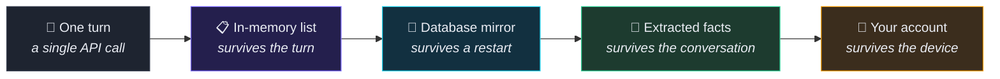
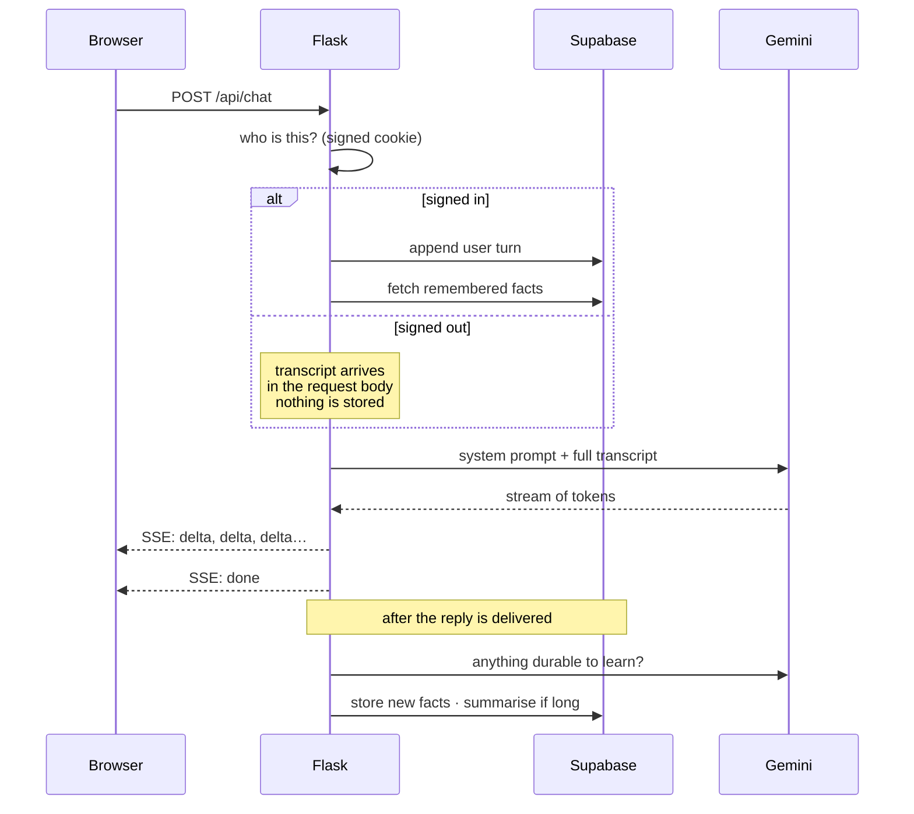
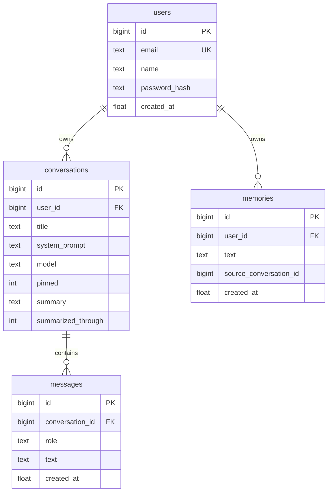
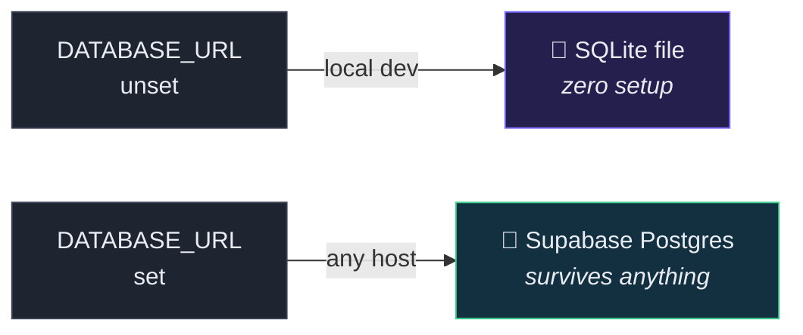

<div align="center">


<br/><br/>

### [**→ Try it live**](https://mnemo-bot.vercel.app/)

<sub>No sign-up needed to start talking.</sub>

<br/>

[](https://mnemo-bot.vercel.app/)


<br/>

**Named after Mnemosyne, the Greek personification of memory.**

Most chatbots forget you the moment you close the tab. Mnemo doesn't.

</div>

---

## 🌐 Live demo

### **https://mnemo-bot.vercel.app**

Running on Vercel, backed by Supabase Postgres. **No sign-up required to try it** — open the link and start typing. That conversation stays in your browser and is never written down.

Make an account and it's saved, along with everything the bot learns about you, waiting on any device you sign in from. The chat you started before signing up comes with you.

| | |
|---|---|
| 🔗 **App** | https://mnemo-bot.vercel.app |
| 💻 **Source** | https://github.com/HassanKhalid8/Mnemo-bot |

---

## Why this exists

Every LLM API is **stateless**. Send a message, get a reply, and the model retains nothing. The illusion of memory is entirely the application's job — you resend the whole transcript on every single turn.

Mnemo starts from that primitive and builds five increasingly durable layers of memory on top of it:



Each layer outlives the one before it. That progression *is* the project.

---

## Features

<table>
<tr>
<td width="50%" valign="top">

### 🧠 Memory that compounds
Facts about you are pulled out of conversations in the background and fed into **every** future chat. Tell it your stack on Monday; it still knows on Friday, in a thread that didn't exist yet.

</td>
<td width="50%" valign="top">

### 💾 Nothing is lost
Every turn is mirrored to Postgres as it happens. Close the tab, kill the server, redeploy — your history is exactly where you left it.

</td>
</tr>
<tr>
<td width="50%" valign="top">

### 🚪 No login wall
Land on the page and start typing. That conversation lives in your browser and is never written down. Sign up and it's saved — **including the chat you'd already started**, which gets adopted into your new account.

</td>
<td width="50%" valign="top">

### 🔒 Yours and only yours
Every conversation, message and remembered fact hangs off a user id, and every query filters on it *in the SQL*. Guessing someone else's conversation id returns a 404, not their chat.

</td>
</tr>
<tr>
<td width="50%" valign="top">

### 🕵️ Incognito mode
A thread that lives in RAM and nowhere else. Never written to disk, learns nothing, and is told nothing it already knows. The whole UI goes cold grey so you can't mistake where you are.

</td>
<td width="50%" valign="top">

### 🔍 Search everything
Full-text search across every message you've ever sent, scoped to your account. `Ctrl+K`, type, jump straight to the message in its thread.

</td>
</tr>
<tr>
<td width="50%" valign="top">

### 🔊 Voice in and out
Dictate with the Web Speech API. Replies read back in 14 Microsoft neural voices — free, no API key, no character quota.

</td>
<td width="50%" valign="top">

### 📊 Context you can see
A live token meter in the header. When a thread gets long, the oldest turns are folded into a summary instead of being resent forever.

</td>
</tr>
<tr>
<td width="50%" valign="top">

### ⚡ Streamed replies
Server-Sent Events render each reply as it's generated. A stop button that keeps what already arrived.

</td>
<td width="50%" valign="top">

### 🎭 Per-chat personality
Each conversation picks its own model and custom instructions. One thread a tutor, the next a code reviewer.

</td>
</tr>
</table>

<details>
<summary><b>… and the smaller things</b></summary>

<br/>

| | |
|---|---|
| **Regenerate & edit** | Rewind to any message and replay from there |
| **Pin conversations** | Keeps them above the date groups |
| **Export** | JSON (the raw history array) or Markdown (a readable transcript) |
| **Markdown rendering** | Headings, tables, lists, and code blocks with copy buttons |
| **Light & dark themes** | Follows your system, remembers your override |
| **Fully responsive** | Sidebar collapses to a drawer on mobile |
| **Keyboard-first** | `Ctrl+K` search · `Ctrl+J` new chat · `Ctrl+Shift+M` dictate · `Esc` closes anything |

</details>

---

## How a message travels



---

## Data model

Everything below `users` is owned. There is no unowned path to a row.



`memories` is unique on **(user_id, text)**, not on text alone — two people are both allowed to have told it where they live.

---

## How the memory actually works

<details open>
<summary><b>Layer 1 — the in-memory list</b></summary>

<br/>

A plain Python list per conversation. This is the mechanism that makes the model appear to remember:

```python
conversation_histories = {}   # {conversation_id: [{"role": ..., "text": ...}, ...]}

history.append({"role": "user", "text": user_message})

response = client.models.generate_content_stream(
    model=model,
    contents=build_contents(history),   # the entire transcript, every single call
    config=types.GenerateContentConfig(system_instruction=system_prompt),
)

history.append({"role": "model", "text": assistant_reply})
```

Gemini is stateless between requests. Resending the list is the whole trick.

</details>

<details>
<summary><b>Layer 2 — the database mirror</b></summary>

<br/>

Four tables, no ORM, zero extra dependencies beyond the driver. Every append to the list also writes a row. On the first request after a restart, the list rebuilds itself from the table — so live chat reads stay in RAM, and the database is purely the safety net.

The same SQL runs on both backends. Queries are written once with SQLite-style `?` placeholders and translated on the way out, so there is exactly one copy of every query in the codebase.

</details>

<details>
<summary><b>Layer 3 — extracted facts</b></summary>

<br/>

After each exchange, a background job asks a small, cheap model one question: *is there anything here worth knowing weeks from now?*

Durable facts (your name, your stack, an ongoing project) go into a `memories` table and get injected into the system prompt of every conversation you own. Transient chatter is discarded — the extractor is told to prefer returning nothing, because that's the common case.

Two layers of de-duplication stop the same fact being re-learned in slightly different words every turn: the model is shown what's already known, and anything that slips through is caught by Jaccard word-overlap.

Everything it has learned is visible and individually deletable under **What it remembers**.

</details>

<details>
<summary><b>Layer 4 — summarisation</b></summary>

<br/>

Past a token threshold, the oldest turns are collapsed into prose and stored on the conversation. Subsequent calls send that summary in place of those turns, so a long thread stays cheap and fast without amnesia.

</details>

<details>
<summary><b>Layer 5 — your account</b></summary>

<br/>

Email and password, hashed with PBKDF2-SHA256. Identity lives in Flask's cryptographically signed session cookie — there is no server-side session store to run, which is what makes it work on serverless.

Signed out, the app is fully usable: the browser holds the transcript and posts it back with each turn, the server writes nothing, and no stored memory is read or learned. Sign up and the conversation you were in the middle of is offered up and adopted into the new account.

</details>

---

## Quick start

> [!TIP]
> Just want to see it work? It's already deployed at **https://mnemo-bot.vercel.app** — no setup, no API key, no account.

> **Prerequisites:** Python 3.10+ and a free Gemini API key from [Google AI Studio](https://aistudio.google.com/app/apikey).

```bash
git clone https://github.com/HassanKhalid8/Mnemo-bot.git
cd Mnemo-bot

python -m venv .venv
.venv\Scripts\activate          # macOS/Linux: source .venv/bin/activate

pip install -r requirements.txt

cp .env.example .env            # then fill it in

python app.py
```

Open **http://localhost:5000**. With no `DATABASE_URL` set it uses a local SQLite file — zero setup.

<details>
<summary><b>Configuration</b></summary>

<br/>

| Variable | Default | Purpose |
|---|---|---|
| `GEMINI_API_KEY` | *required* | Your key from Google AI Studio |
| `SECRET_KEY` | dev fallback | Signs the login cookie. **Set this in production** — changing it signs everyone out |
| `DATABASE_URL` | *unset* | Postgres connection string. **Unset → local SQLite file** |
| `SECURE_COOKIES` | auto | Send the session cookie over HTTPS only. Implied on Vercel |
| `GEMINI_MODEL` | `gemini-flash-latest` | Default chat model |
| `GEMINI_UTILITY_MODEL` | `gemini-flash-lite-latest` | Cheap model for background fact extraction |
| `SUMMARY_TRIGGER_TOKENS` | `8000` | Token count that triggers summarisation |
| `KEEP_RECENT_MESSAGES` | `8` | Turns kept verbatim when summarising |
| `SERVERLESS` | auto | Set to `1` on serverless hosts. Vercel sets `VERCEL` itself |

Generate a secret key with:

```bash
python -c "import secrets; print(secrets.token_hex(32))"
```

</details>

---

## Deploying

Locally, history lives in a SQLite file. **That file cannot survive a serverless host** — the filesystem is wiped between invocations, so every visitor would get an empty database. Set `DATABASE_URL` and the exact same code talks to Postgres instead:



Nothing else changes — the schema, the queries, and the in-memory list all behave identically.

### 1 · Create the database

[Supabase](https://supabase.com) free tier. Create a project, then **Connect → Direct → Connection string**, format **URI**.

> [!IMPORTANT]
> Take the **Transaction pooler** string — host contains `pooler.supabase.com`, port `6543` — not the direct `db.<ref>.supabase.co` one. Serverless opens a fresh connection per request and will exhaust the direct host's limit. Replace `[YOUR-PASSWORD]` with your real password, and percent-encode it if it contains `@ : / ? # %`.

The tables create themselves on first run. There is no SQL to paste anywhere.

### 2 · Deploy to Vercel

`vercel.json` and `api/index.py` are already in the repo. Import the project on [vercel.com](https://vercel.com/new), then add three environment variables (Production, Preview **and** Development):

```
GEMINI_API_KEY   = your Google AI Studio key
SECRET_KEY       = a long random hex string
DATABASE_URL     = your Supabase pooler URI
```

Redeploy after adding them — environment variables only take effect at build time.

> [!WARNING]
> **Serverless trade-offs.** Functions are short-lived and isolated, which costs two things:
> - **Streaming may buffer.** Replies can arrive in chunks rather than word-by-word. Degrades gracefully — nothing breaks, it just feels less live.
> - **Incognito threads are per-instance.** They're held in RAM by design, so a follow-up landing on a different instance reports as purged. Fine at low traffic.
>
> For the full experience, a long-running host (Render, Railway, Fly) works without either caveat: `gunicorn app:app --workers 1 --threads 8 --timeout 120`.

### 3 · Verify

```bash
curl https://your-app.vercel.app/api/config
```

Then sign in and hit `/api/history` — `"storage": "postgres"` means persistence is live. `"sqlite"` means `DATABASE_URL` didn't reach the app.

<details>
<summary><b>Moving existing local chats across</b></summary>

<br/>

Rows created before accounts existed have no owner and won't show up for anyone. `migrate_to_supabase.py` copies them into the hosted database under one account:

```bash
# 1. put the Supabase URI in .env as DATABASE_URL
# 2. start the app and create your account through the sign-up form
# 3. then, once:
python migrate_to_supabase.py you@example.com --dry-run   # see what it would copy
python migrate_to_supabase.py you@example.com             # do it
```

It only ever reads the SQLite file, preserves titles, models, pins and timestamps, and refuses to run twice for the same account unless you pass `--again`.

</details>

---

## API

<details>
<summary><b>Every endpoint</b></summary>

<br/>

**Auth**

| Method | Route | Purpose |
|---|---|---|
| `GET` | `/api/auth/me` | Current user, or `null` |
| `POST` | `/api/auth/signup` | Create an account and sign in |
| `POST` | `/api/auth/login` | Sign in |
| `POST` | `/api/auth/logout` | Clear the session |

**Chat**

| Method | Route | Purpose |
|---|---|---|
| `POST` | `/api/chat` | Send a turn, receive an SSE stream. Works signed out via `guest_history` |
| `GET` | `/api/config` | Models, defaults, whether a key is configured |
| `GET` | `/api/context` | Token usage for a conversation |

**Conversations** *(all require auth)*

| Method | Route | Purpose |
|---|---|---|
| `GET` `POST` `DELETE` | `/api/conversations` | List · create · wipe all |
| `GET` `PATCH` `DELETE` | `/api/conversations/<id>` | Read · rename/pin/configure · delete |
| `POST` | `/api/conversations/import` | Adopt a signed-out transcript |
| `POST` | `/api/reset` | Clear one thread's messages, keep the thread |
| `GET` | `/api/search?q=` | Full-text search your messages |
| `GET` | `/api/history` | Raw in-memory arrays + stats + which backend is live |

**Memory** *(all require auth)*

| Method | Route | Purpose |
|---|---|---|
| `GET` `POST` `DELETE` | `/api/memories` | List · teach directly · forget everything |
| `DELETE` | `/api/memories/<id>` | Forget one fact |
| `POST` | `/api/memories/dedupe` | Collapse facts that say the same thing |

**Other**

| Method | Route | Purpose |
|---|---|---|
| `POST` `DELETE` | `/api/incognito` | Start / purge a RAM-only thread |
| `GET` | `/api/voices` | Available neural voices |
| `POST` | `/api/tts` | Synthesise speech (returns MP3) |

</details>

---

## Security notes

- Passwords are stored **only** as PBKDF2-SHA256 hashes. Nothing in the codebase can read a password back.
- Login failures return one message for both "no such account" and "wrong password", so the form can't be used to enumerate registered emails.
- Ownership is enforced **in the query**, not in a route guard — `WHERE id = ? AND user_id = ?`. A conversation you don't own is indistinguishable from one that doesn't exist.
- The session cookie is `HttpOnly`, `SameSite=Lax`, and `Secure` in production.
- `.env` and the local database are gitignored and have never been committed.
- Incognito threads and signed-out chats never read stored memories, so nothing can leak into a conversation that isn't the owner's.

---

## Project layout

```
Mnemo-bot/
├── app.py                  # Flask server · Gemini calls · accounts · the in-memory lists
├── db.py                   # storage: SQLite or Postgres, same schema either way
├── tts.py                  # edge-tts wrapper + curated voice list
├── migrate_to_supabase.py  # one-shot: local SQLite history -> hosted Postgres
├── requirements.txt
├── vercel.json             # serverless routing + bundled templates/static
├── .env.example
├── api/
│   └── index.py            # serverless entry point (re-exports the Flask app)
├── templates/
│   └── index.html          # the whole UI
└── static/
    ├── script.js           # frontend: SSE, auth, conversations, search, voice
    ├── style.css           # dark-first design system, full light theme
    └── markdown.js         # dependency-free Markdown renderer
```

---

## Roadmap

- [x] Multi-user sessions keyed on a cookie
- [x] Hosted Postgres via Supabase
- [ ] Password reset by email
- [ ] File and image attachments (Gemini is already multimodal)
- [ ] Postgres full-text search with ranking
- [ ] Token and latency dashboard

---

<div align="center">

Built with Flask, Gemini, Supabase, and a plain Python list.

[**Try it live →**](https://mnemo-bot.vercel.app/)


</div>
