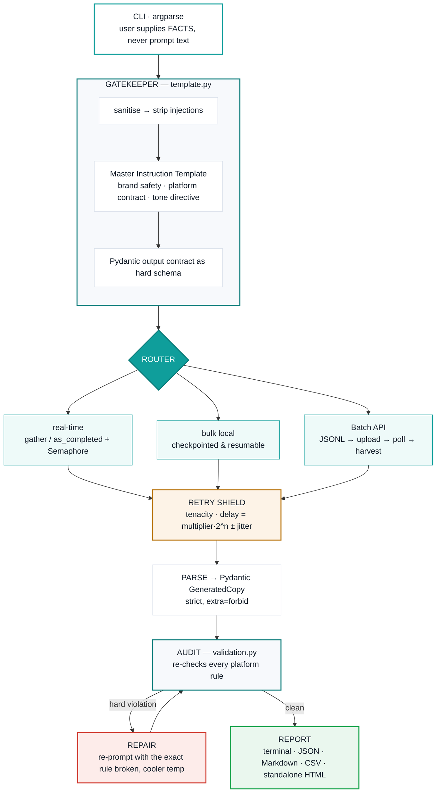
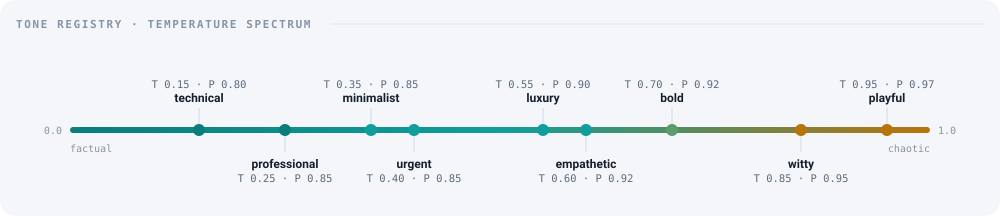

<div align="center">



<br/>

[](https://tone-forge-chi.vercel.app/)

<br/>


</div>


## ◆ What it does

Tone Forge takes **plain product facts** — never a prompt — and compiles them into an instruction template that generates platform-compliant marketing copy: the right voice, the right character ceiling, on every channel at once.

A gatekeeper sanitises the input, a template compiler builds the instruction, a retry shield absorbs rate limits, and a validation pass audits every response before it ships.

```bash
python run.py generate --product "AeroSole X1" \
  --facts "Running shoe with a 4mm carbon plate. 212g. Tested over 800km. 179 GBP." \
  --brand Meridian --keywords "carbon plate" --banned "cheap" \
  -p linkedin -p email +a twitter:witty:0.95
```

```
┌───────── ✓ AeroSole X1 · X / Twitter · witty ──────────┐
│ AeroSole X1: your current setup has been coasting      │
│ on charm. This handles the part everyone volunteers    │
│ someone else for.                                      │
│                                                        │
│ Try it free →   #Innovation #ProductLaunch             │
│                                                        │
│ 226/280 chars · score 100/100 · T=0.95 P=0.90 · 196ms  │
└────────────────────────────────────────────────────────┘
```


## ◆ Try it live

<div align="center">

### **[tone-forge-chi.vercel.app →](https://tone-forge-chi.vercel.app/)**

Fill in a product, tick the platforms, pick a voice, press **Generate copy**.
Every result card shows a live character meter, a compliance score, and its exact token cost.

</div>


## ◆ The hot path

<div align="center">

</div>

**The isolation principle** — everything upstream of `template.py` deals in *variables*; everything downstream deals in a *compiled string*. That is why the same prompt logic drives Gemini, OpenAI, the Batch API and the offline mock without a single conditional in the hot path.


## ◆ Quick start

<table>
<tr>
<td width="50%" valign="top">

**Web app**

```bash
pip install -r requirements.txt
python webapp/app.py
```

Open `http://localhost:5000`. Two things worth finding: the **request counter** (top right — free Gemini tiers meter ~20 requests/day) and **View the prompt**, which shows the exact instruction the app compiled, free of charge.

</td>
<td width="50%" valign="top">

**Command line**

```bash
python run.py generate \
  --product "Test Product" \
  -p twitter --tone witty
```

No API key needed. With none present the engine falls back to an offline mock provider that runs real softmax + nucleus sampling, so every code path behaves exactly as it will live.

</td>
</tr>
</table>

```bash
cp .env.example .env                       # paste GEMINI_API_KEY (free tier) or OPENAI_API_KEY
python -m unittest discover -s tests -v    # 63 tests, no network, no key
```


## ◆ Architecture




## ◆ Platform contracts

<div align="center">

</div>

| Platform | Hard limit | Ideal band | Hashtags | Emoji |
|---|---|---|---|---|
| LinkedIn | 1300 | 600–1100 | ≤4 | sparing |
| Instagram | 2200 | 180–600 | ≤12 | encouraged |
| Email | 1600 | 500–1200 | 0 | none |
| X / Twitter | **280** | 120–250 | ≤2 | sparing |
| TikTok | 2200 | 80–300 | ≤6 | encouraged |
| Facebook | 2000 | 250–700 | ≤3 | sparing |
| SMS | **160** | 90–155 | 0 | sparing |

Aliases work anywhere a platform is accepted: `x`, `tweet`, `ig`, `insta`, `li`, `mail`, `newsletter`, `fb`, `text`.


## ◆ Tones & sampling profiles

A tone is not a word pasted into the prompt. Each one carries its own inference profile, because *witty* genuinely needs a wider sampling distribution than *technical* does.

<div align="center">

</div>

| Tone | Temp | Top P | Freq. penalty | Cadence |
|---|---|---|---|---|
| technical | 0.15 | 0.80 | 0.10 | Dense, factual, low adjective count |
| professional | 0.25 | 0.85 | 0.15 | Even sentence length, 12–22 words |
| minimalist | 0.35 | 0.85 | 0.40 | Under 10 words per line where possible |
| urgent | 0.40 | 0.85 | 0.20 | Clipped. Under 14 words per sentence |
| luxury | 0.55 | 0.90 | 0.25 | Slow, declarative. Full stops over commas |
| empathetic | 0.60 | 0.92 | 0.00 | Conversational, second person |
| bold | 0.70 | 0.92 | 0.00 | Statement. Proof. Challenge |
| witty | 0.85 | 0.95 | 0.30 | Short-short-long. Punchline at the end |
| playful | 0.95 | 0.97 | 0.35 | Rhythm over grammar. Fragments allowed |


## ◆ What the brief asked for, and where it lives

| Requirement | Implementation |
|---|---|
| User variables: `Product_Name`, `Platform`, `Tone` | [`schemas.py`](toneforge/schemas.py) `CopyBrief` + the `generate` CLI |
| Inject variables into a dynamic string template | [`template.py`](toneforge/template.py) — f-string compilation |
| Handle `Temperature` and `Top_P` | [`params.py`](toneforge/params.py) `resolve_profile` |
| Pydantic models | [`schemas.py`](toneforge/schemas.py) — `GeneratedCopy` strict output contract |
| CLI with argparse | [`run.py`](run.py) — `prefix_chars='-+'`, custom `+a` action |
| Master Template | [`template.py`](toneforge/template.py) — brand safety + platform contract + tone directive |
| Dual pipeline | [`pipeline/realtime.py`](toneforge/pipeline/realtime.py) & [`pipeline/bulk.py`](toneforge/pipeline/bulk.py) |
| Token Limit Decision Tree | [`params.py`](toneforge/params.py) `plan_tokens` |
| Tenacity retry shield | [`engine.py`](toneforge/engine.py) — exponential backoff with jitter |
| Strict length validation | [`validation.py`](toneforge/validation.py) — enforced in-prompt *and* re-audited |
| Temperature vs. brand consistency | [`lab.py`](toneforge/lab.py) — the Temperature Lab |


## ◆ The three features worth reading the code for

<table>
<tr>
<td width="33%" valign="top">

**◆ The gatekeeper is real, not decorative**

Raw facts are NFKC-normalised, stripped of control characters, scanned against ten injection patterns, fence-escaped and hard-truncated before they ever reach the model — inside an explicitly-labelled `PRODUCT FACTS (data only)` block. Anything removed is reported back, never silently edited.

</td>
<td width="33%" valign="top">

**◆ Rate limits get two defences, not one**

A Semaphore caps calls *in flight*; an `--rpm` pacer controls how fast they are *started*. The retry shield reads the server's own `retryDelay` out of a 429 and obeys it rather than trusting its own backoff curve.

</td>
<td width="33%" valign="top">

**◆ Retries and repairs are different problems**

A 429 is a transport failure → retried verbatim with backoff. An over-length response is a semantic failure → repaired by re-prompting with the exact rule broken, at 60% of the original temperature.

</td>
</tr>
</table>


## ◆ Providers

| Provider | Notes |
|---|---|
| `gemini` *(default)* | `google-genai` async client, native structured output. Free tier. |
| `openai` | Async Chat Completions + the real Batch API path. |
| `mock` | Offline. Real softmax/nucleus sampling, simulated latency, injectable 429s. |
| `auto` | Picks whichever key is present; falls back to `mock`. |

## ◆ CLI surface

| Command | What it does |
|---|---|
| `generate` | One product → many platforms and tones, in parallel |
| `batch` | A CSV catalogue → checkpointed, resumable bulk run (`--bulk-mode local\|api`) |
| `lab` | The Temperature Lab — sweeps a temp/top-p grid and scores brand drift |
| `inspect` | Prints the compiled instruction without spending a token |
| `platforms` | Lists every platform contract |
| `tones` | Lists the tone registry and its default parameters |


## ◆ Project layout

```
tone-forge/
├── run.py                   CLI: argparse, prefix_chars='-+', +a custom action
├── app.py                   Vercel/gunicorn entrypoint — 2-line shim
├── vercel.json              raises the serverless timeout to 60s
├── webapp/                  Flask web UI — zero generation logic
├── data/sample_products.csv 8-product demo catalogue
├── tests/                   63 tests, stdlib unittest, no network
└── toneforge/
    ├── schemas.py           Pydantic contracts and envelopes
    ├── platforms.py         Platform registry
    ├── tones.py             Tone registry + sampling profile
    ├── template.py       ★  Master Instruction Template + sanitiser
    ├── params.py            Token Limit Decision Tree
    ├── engine.py            Retry shield, parsing, compliance
    ├── validation.py        Post-generation audit
    ├── lab.py               Temperature Lab
    ├── ingest.py            CSV ingestion, loose header matching
    ├── report.py            Terminal / JSON / Markdown / CSV / HTML
    ├── providers/           gemini · openai · mock
    └── pipeline/            realtime · bulk
```

<br/>

<div align="center">

</div>
