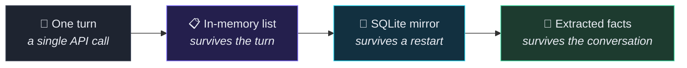

<div align="center">


<br/><br/>


<br/>

**Named after Mnemosyne, the Greek personification of memory.**

Most chatbots forget you the moment you close the tab. Mnemo doesn't.

</div>

---

## Why this exists

Every LLM API is **stateless**. Send a message, get a reply, and the model retains nothing. The illusion of memory is entirely the application's job — you resend the whole transcript on every single turn.

Mnemo starts from that primitive and builds four increasingly durable layers of memory on top of it:



Each layer outlives the one before it. That progression *is* the project.

---

## Features

<table>
<tr>
<td width="50%" valign="top">

### 🧠 Memory that compounds
Facts about you are pulled out of conversations in the background and fed into **every** future chat. Tell it your stack on Monday; it still knows on Friday, in a thread that didn't exist yet.

</td>
<td width="50%" valign="top">

### 💾 Nothing is lost
Every turn is mirrored to SQLite as it happens. Close the tab, kill the server, reboot the machine — your history is exactly where you left it.

</td>
</tr>
<tr>
<td width="50%" valign="top">

### 🕵️ Incognito mode
A thread that lives in RAM and nowhere else. Never written to disk, learns nothing, and is told nothing it already knows. The whole UI goes cold grey so you can't mistake where you are.

</td>
<td width="50%" valign="top">

### 🔍 Search everything
`Ctrl+K` searches every message you've ever sent. Arrow keys to move, Enter to jump straight to that moment in its conversation.

</td>
</tr>
<tr>
<td width="50%" valign="top">

### 🔊 Voice in and out
14 Microsoft neural voices — **no API key, no character quota**. Plus dictation through the Web Speech API. Fully hands-free if you want it.

</td>
<td width="50%" valign="top">

### 📊 Context you can see
A live token meter in the header. When a thread gets long, the oldest turns are folded into a summary instead of being resent forever.

</td>
</tr>
<tr>
<td width="50%" valign="top">

### ⚡ Streamed replies
Server-Sent Events render each reply as it's generated. A stop button that keeps what already arrived.

</td>
<td width="50%" valign="top">

### 🎭 Per-chat personality
Each conversation picks its own model and custom instructions. One thread a tutor, the next a code reviewer.

</td>
</tr>
</table>

<details>
<summary><b>… and the smaller things</b></summary>

<br/>

| | |
|---|---|
| **Regenerate & edit** | Rewind to any message and replay from there |
| **Pin conversations** | Keeps them above the date groups |
| **Export** | JSON (the raw history array) or Markdown (a readable transcript) |
| **Markdown rendering** | Headings, tables, lists, and code blocks with copy buttons |
| **Light & dark themes** | Follows your system, remembers your override |
| **Fully responsive** | Sidebar collapses to a drawer on mobile |
| **Keyboard-first** | `Ctrl+K` search · `Ctrl+J` new chat · `Ctrl+Shift+M` dictate · `Esc` closes anything |

</details>

---

## How the memory actually works

<details open>
<summary><b>Layer 1 — the in-memory list</b></summary>

<br/>

A plain Python list per conversation. This is the mechanism that makes the model appear to remember:

```python
conversation_histories = {}   # {conversation_id: [{"role": ..., "text": ...}, ...]}

history.append({"role": "user", "text": user_message})

response = client.models.generate_content_stream(
    model=model,
    contents=build_contents(history),   # the entire transcript, every single call
    config=types.GenerateContentConfig(system_instruction=system_prompt),
)

history.append({"role": "model", "text": assistant_reply})
```

Gemini is stateless between requests. Resending the list is the whole trick.

</details>

<details>
<summary><b>Layer 2 — the SQLite mirror</b></summary>

<br/>

Two tables, no ORM, zero extra dependencies:

```sql
conversations (id, title, created_at, updated_at, system_prompt, model, pinned, summary, ...)
messages      (id, conversation_id, role, text, created_at)
```

Every append to the list also writes a row. On the first request after a restart, the list rebuilds itself from the table — so live chat reads stay in RAM, and disk is purely the safety net.

</details>

<details>
<summary><b>Layer 3 — extracted facts</b></summary>

<br/>

After each exchange, a background thread asks a small, cheap model one question: *is there anything here worth knowing weeks from now?*

Durable facts (your name, your stack, an ongoing project) go into a `memories` table and get injected into the system prompt of every conversation. Transient chatter is discarded — the extractor is told to prefer returning nothing, because that's the common case.

Everything it has learned is visible and individually deletable under **What it remembers**.

</details>

<details>
<summary><b>Layer 4 — summarisation</b></summary>

<br/>

Past a token threshold, the oldest turns are collapsed into prose and stored on the conversation. Subsequent calls send that summary in place of those turns, so a long thread stays cheap and fast without amnesia.

</details>

---

## Quick start

> **Prerequisites:** Python 3.10+ and a free Gemini API key from [Google AI Studio](https://aistudio.google.com/app/apikey).

```bash
git clone https://github.com/<your-username>/mnemo.git
cd mnemo

python -m venv .venv
.venv\Scripts\activate          # macOS/Linux: source .venv/bin/activate

pip install -r requirements.txt

cp .env.example .env            # then paste your key into .env

python app.py
```

Open **http://localhost:5000**.

> [!TIP]
> Run `app.py` with the same interpreter you installed into. If the voice picker says *"edge-tts isn't installed"*, you're on a different Python.

<details>
<summary><b>Configuration</b></summary>

<br/>

| Variable | Default | Purpose |
|---|---|---|
| `GEMINI_API_KEY` | *required* | Your key from Google AI Studio |
| `GEMINI_MODEL` | `gemini-flash-latest` | Default chat model |
| `GEMINI_UTILITY_MODEL` | `gemini-flash-lite-latest` | Cheap model for background fact extraction |
| `SUMMARY_TRIGGER_TOKENS` | `8000` | Token count that triggers summarisation |
| `KEEP_RECENT_MESSAGES` | `8` | Turns kept verbatim when summarising |

</details>

---

## Project layout

```
mnemo/
├── app.py              # Flask server · Gemini calls · the in-memory lists
├── db.py               # SQLite: conversations, messages, memories, search
├── tts.py              # edge-tts wrapper + curated voice list
├── requirements.txt
├── .env.example
├── templates/
│   └── index.html      # app shell
└── static/
    ├── style.css       # design tokens, both themes, incognito palette
    ├── markdown.js     # hand-rolled Markdown renderer (escapes before parsing)
    └── script.js       # conversations · SSE streaming · search · voice
```

<details>
<summary><b>API reference</b></summary>

<br/>

| Method | Endpoint | Purpose |
|---|---|---|
| `GET` | `/api/conversations` | List threads |
| `POST` | `/api/conversations` | Create a thread |
| `GET` `PATCH` `DELETE` | `/api/conversations/<id>` | Read · rename/pin/configure · delete |
| `POST` | `/api/chat` | SSE stream: `start` → `delta` → `done` / `error` |
| `POST` | `/api/reset` | Clear one thread's messages, or all |
| `GET` | `/api/history` | The raw in-memory array, for inspection |
| `GET` | `/api/search?q=` | Search every stored message |
| `GET` `POST` `DELETE` | `/api/memories` | Long-term facts |
| `POST` | `/api/incognito` | Start a RAM-only thread |
| `DELETE` | `/api/incognito/<id>` | Purge it |
| `GET` | `/api/context` | Token usage for a thread |
| `GET` | `/api/voices` | Available voices |
| `POST` | `/api/tts` | Text → `audio/mpeg` |

</details>

---

## Notes

**On voice.** Mnemo uses [`edge-tts`](https://pypi.org/project/edge-tts/), which speaks to the same free endpoint Microsoft Edge's *Read aloud* uses. No key, no account, no monthly character cap. The voices are the neural models Azure Speech sells. Fair-use limits apply if you hammer it; for normal chat playback it's effectively unlimited. If it's ever unreachable, the app falls back to the browser's built-in speech engine.

**On rate limits.** Gemini's free tier caps requests per minute and per day. Hitting one produces a clear message rather than a stack trace. `Flash Lite` has the most generous quota; `Pro` has very little.

**On security.** Model output is HTML-escaped *before* Markdown parsing, so only tags the renderer itself generates can reach the DOM.

**On privacy.** Everything is local. The SQLite file sits in the project directory and is gitignored — no history leaves your machine except the transcript sent to Gemini to generate each reply.

---

## Roadmap

- [ ] File and image attachments (Gemini is already multimodal)
- [ ] SQLite FTS5 for ranked search
- [ ] Multi-user sessions keyed on a cookie
- [ ] Token and latency dashboard

---

<div align="center">

Built with Flask, Gemini, and a plain Python list.


</div>
